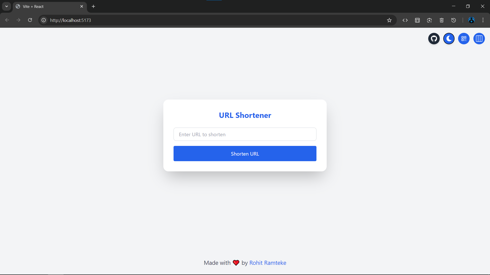
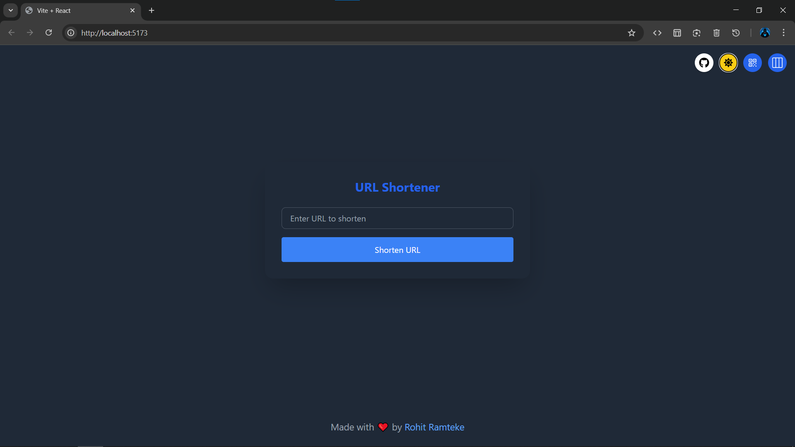
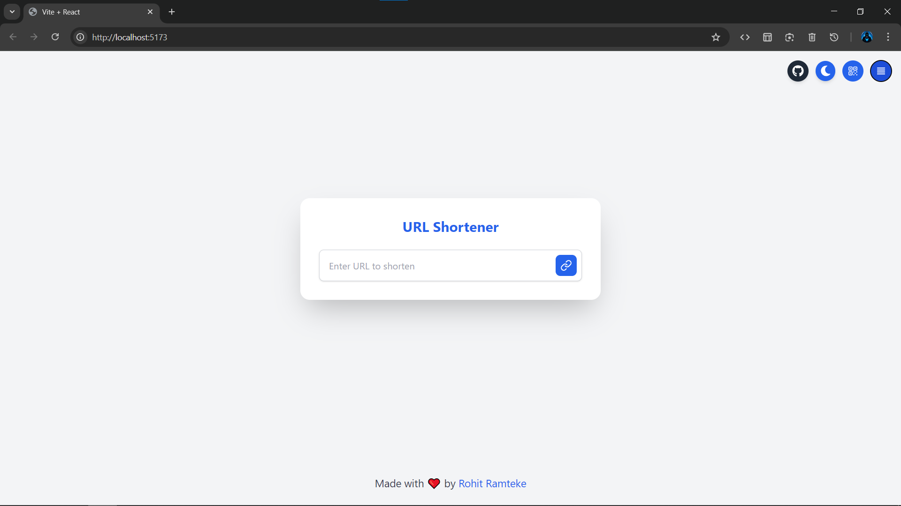
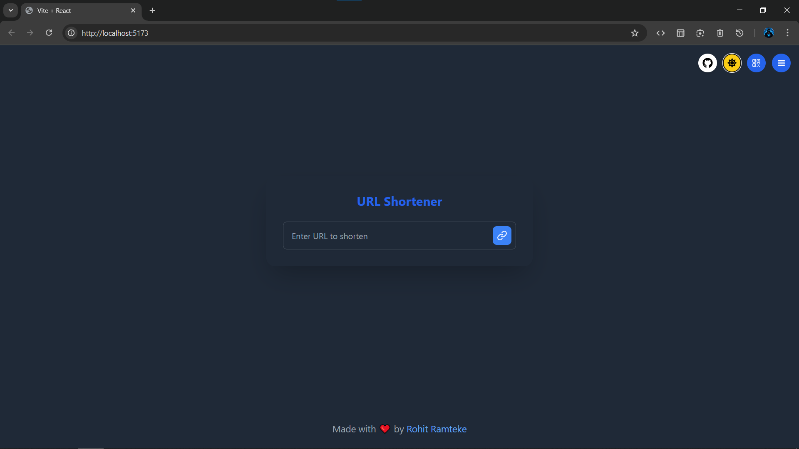
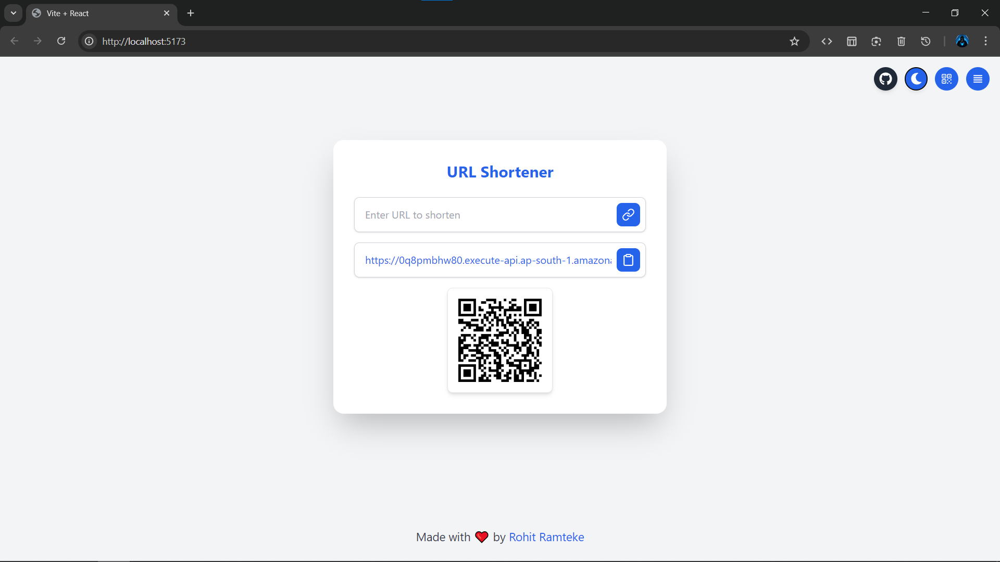
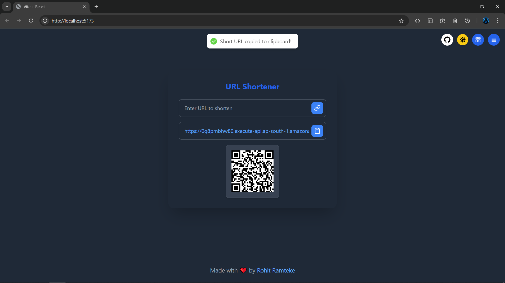
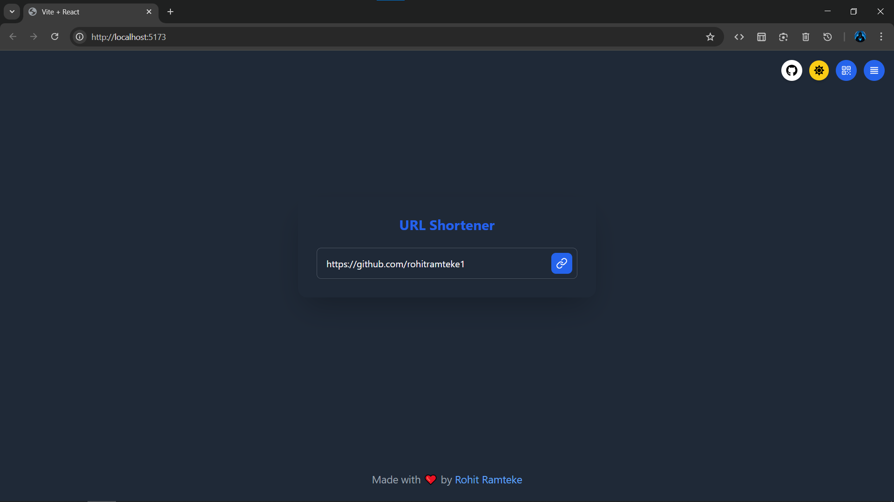
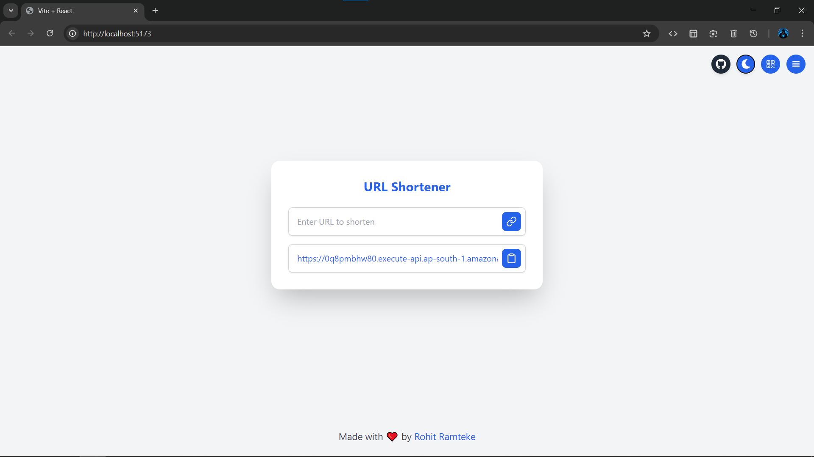
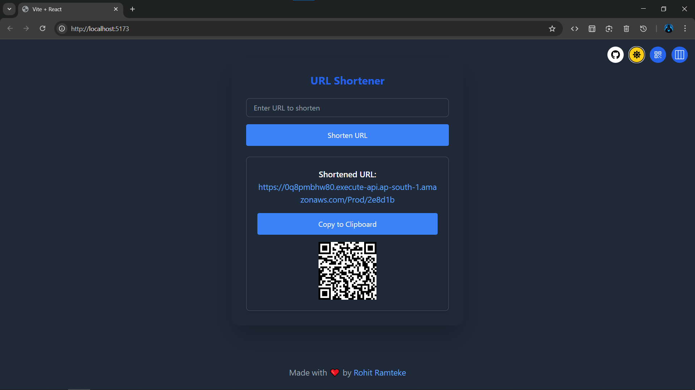

# 🔗 URL Shortener API

A scalable, secure, and serverless URL Shortener built using AWS SAM, Lambda, DynamoDB, API Gateway, and modern web technologies.

---

## 📸 UI Previews

| 💡 Light Mode | 🌙 Dark Mode |
|--------------|-------------|
|  |  |
|  |  |
|  |  |

---

## 🔗 Feature Snapshots

| Shortened Link Added | Full UI Preview |
|----------------------|-----------------|
|  |  |

---

## 🧩 QR Code Variants

| Default Mode | Stacked Mode | Stacked Dark |
|--------------|--------------|--------------|
|  |  |  |

---

---

## 📁 Documentation

- [🚀 Backend Setup & Deployment](./docs/backend.md)
- [🌐 API Endpoints](./docs/backend.md#-api-endpoints)
- [🛠 Infrastructure (AWS SAM)](./docs/infrastructure.md)
- [🖥️ Frontend Integration](./docs/frontend.md)
- [⚙️ Environment Configuration](./docs/backend.md#️-setup--deployment)
- [🔑 API Gateway Security](./docs/backend.md#-api-gateway-security)
- [🐳 Run DynamoDB Locally](./docs/backend.md#-running-dynamodb-locally-using-docker)
- [🚩 Common Issues](./docs/backend.md#-common-issues)
- [📐 Testing with Postman](./docs/backend.md#-testing)
- [🚀 Future Improvements](./docs/frontend.md#-continuous-improvement)
- [🤝 Contribution Guidelines](./docs/contributing.md)
- [📜 License](LICENSE)

---
